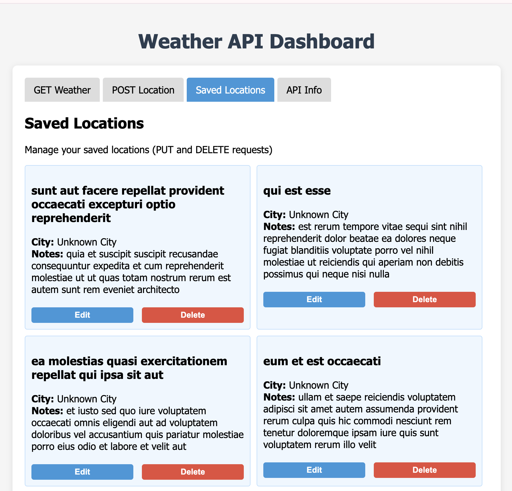

# Weather API Project Reflection

##  Main Concepts Applied

In this practical, I worked with RESTful APIs using HTML, CSS, and JavaScript. I applied key concepts such as:

- Making API calls with `fetch()`
- Handling GET, POST, PUT, and DELETE requests
- Updating the web page based on user input and server responses
- Structuring a simple front-end project with separate files for HTML and JavaScript
- Using event listeners to handle user actions

---

##  What I Learned

I learned how to connect a web page to external APIs and interact with them using JavaScript. Key learnings include:

- **OpenWeatherMap API** - Helped me understand how to send a GET request and show weather data to the user
- **JSONPlaceholder API** - Helped me practice POST, PUT, and DELETE requests
- **Form handling** - Improved my skills in capturing and processing user input
- **DOM manipulation** - Enhanced my ability to update web page content dynamically
- **User feedback** - Learned how to display meaningful responses and messages to users

---

##  Challenges and How I Solved Them

### Challenge 1: Updating the Location List
- **Problem:** The list of saved locations didn't update immediately after editing or deleting a location
- **Solution:** I fixed this by calling the display function again after each update or delete operation

### Challenge 2: Handling Invalid Inputs and API Errors
- **Problem:** When users entered cities that didn't exist, the app would break or show confusing responses
- **Solution:** I added simple error messages that clearly told the user what went wrong

---

##  Conclusion

This practical gave me a strong understanding of how REST APIs work and how they can be used in real web applications. I gained hands-on experience with:

- Different HTTP methods (GET, POST, PUT, DELETE)
- Handling user input and server responses effectively
- Building interactive web projects with JavaScript
- Problem-solving and debugging API-related issues

Overall, it helped me build more confidence in JavaScript and in developing interactive web projects.