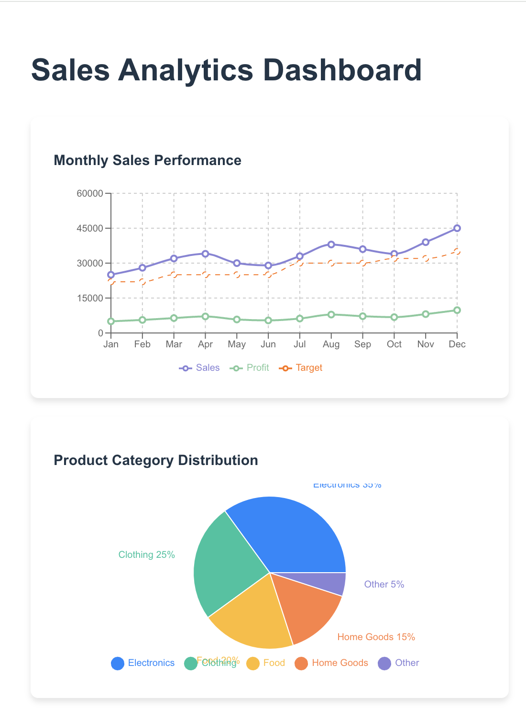
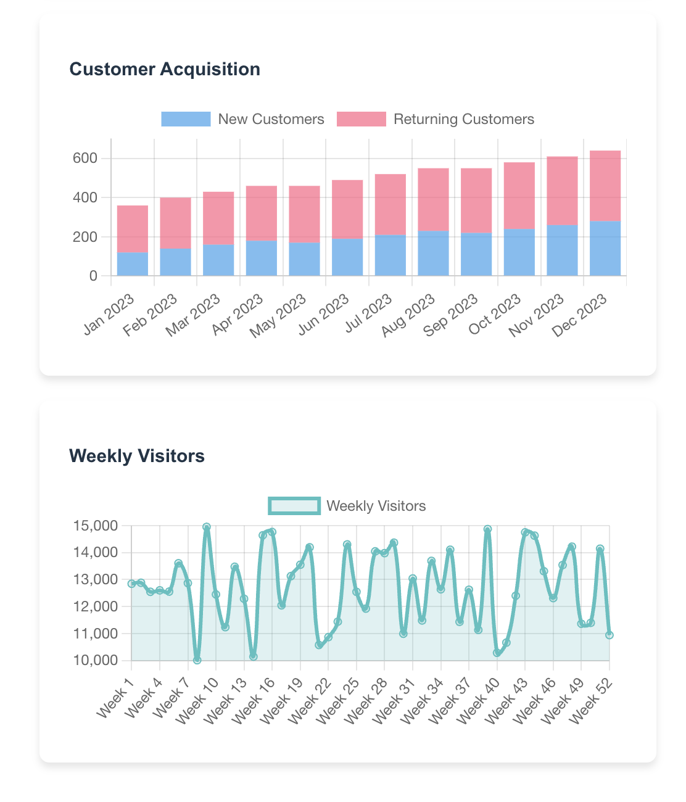

# Data Visualization Reflection

## Main Concepts Applied

In this practical, I created a data visualization dashboard using React and different charting libraries. I applied key data visualization concepts including:

- Multiple chart types implementation: line, pie, bar, and area charts
- Library integration using **Recharts** for line and pie charts
- Library integration using **react-chartjs-2** for bar and area charts
- Component-based architecture with separate chart components
- Data visualization for sales, customer, product, and visitor analytics
- Props-based data passing to chart components
- Unified dashboard interface through main `App.jsx` file

## What I Learned

I learned how to install and use chart libraries in a React project. I now understand how to:

- Install and configure multiple charting libraries in a single React application
- Create different chart types and understand their appropriate use cases
- Pass data to chart components as props with proper formatting
- Make charts responsive and visually appealing
- Organize chart components separately for better code structure and reusability
- Integrate multiple chart components into a unified dashboard interface

This helped me understand how charts can significantly improve data presentation in frontend applications and how visual representation makes data more accessible and meaningful to users.

## Challenges and How I Solved Them

**Challenge 1: Chart Rendering Issues**
- **Problem:** I had trouble getting charts to render correctly, especially when switching between different libraries with different syntax and requirements
- **Solution:** I solved this by carefully following the official documentation for each library (Recharts and react-chartjs-2) to understand the required props, data structure, and component configuration

**Challenge 2: Data Formatting for Different Chart Types**
- **Problem:** Each chart library expected data in different formats, causing rendering issues when the same data structure was used across different chart types
- **Solution:** I solved this by adjusting and transforming the data objects to match the specific format expected by each chart type and library

## Conclusion

This practical gave me a comprehensive introduction to data visualization in React. Key achievements include:

- Understanding how to integrate and use multiple charting libraries effectively
- Learning to choose appropriate chart types for different data visualization needs
- Gaining experience with component-based chart architecture
- Building confidence in data transformation and formatting for visualization
- Understanding the importance of visual data representation in frontend applications

Overall, this practical enhanced my React development skills and provided valuable experience with data visualization libraries like Recharts and Chart.js. I now feel confident building interactive dashboards and choosing the right visualization approach for different types of data presentation needs.